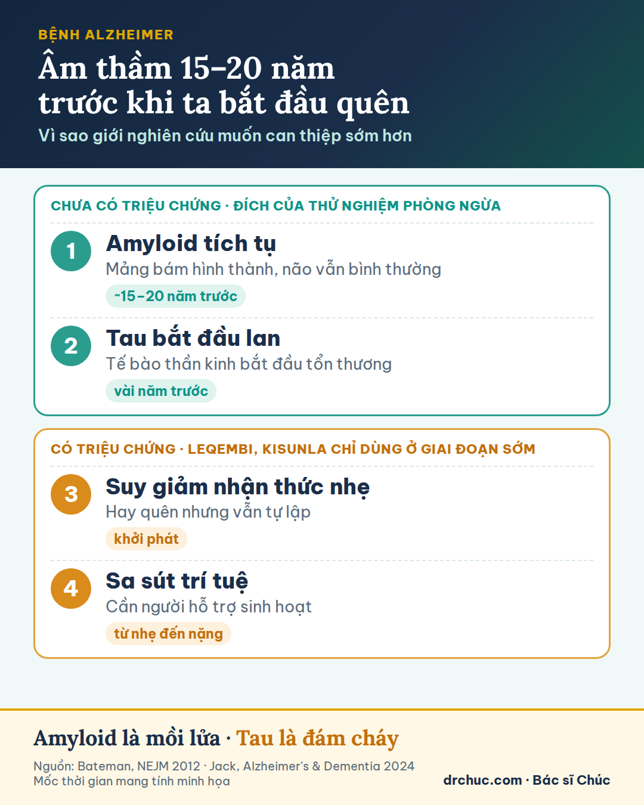
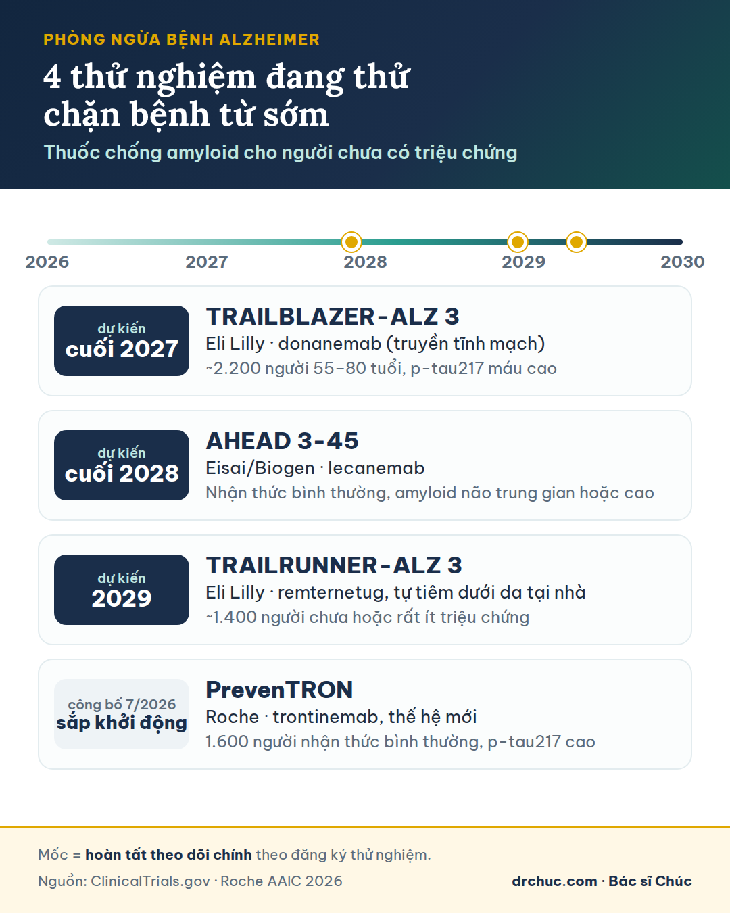
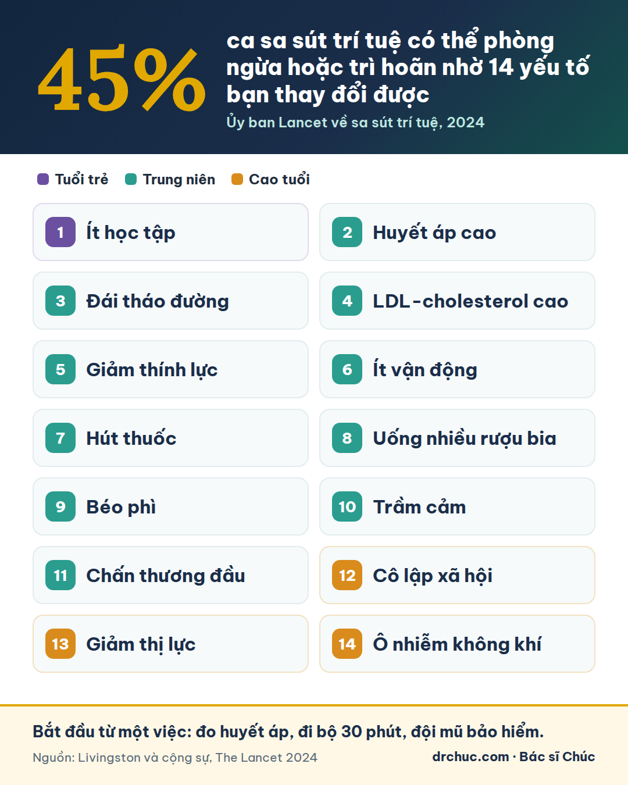

<!-- BÀN GIAO (Claude cloud, 01/10/2026) — đăng bằng skill drchuc-blog-publisher:
- 4 ảnh WebP đã dựng sẵn, BỎ QUA Bước 2 (ChatGPT). Ảnh nằm cùng thư mục với file này; nếu chưa có thì lấy từ GitHub drchuc-hub/landing-pages, nhánh claude/alzheimer-article-analysis-32o5bo, thư mục blog-nhap/thuoc-dieu-tri-benh-alzheimer/.
- Ảnh đại diện (featured, kiêm ảnh chia sẻ Facebook): thuoc-dieu-tri-benh-alzheimer-bac-si-chuc.webp — alt ở featured_image_alt.
- Danh mục WordPress: 79 (Não Bộ & Trí Nhớ), KHÔNG dùng 7. Focus keyword Rank Math: "bệnh Alzheimer"; rank_math_title = seo_title; rank_math_description = meta_description.
- Author box chuẩn (--author-box) + FAQPage (--faq). Khối MedicalWebPage JSON-LD cuối bài giữ nguyên.
- Sau khi đăng: kiểm 4 link nội bộ còn sống, GSC "Yêu cầu lập chỉ mục", thêm link từ bài sa-sut-tri-tue-bat-dau-tu-tuoi-40.
-->

# Bệnh Alzheimer: thuốc mới làm chậm được bệnh, liệu có phòng ngừa được?

Bệnh Alzheimer thường bắt đầu bằng những chuyện rất nhỏ: một người cha hỏi lại câu vừa hỏi năm phút trước, một người mẹ lạc đường ngay trong khu phố đã sống ba mươi năm. Nếu gia đình bạn từng trải qua, bạn hiểu vì sao đây là căn bệnh tuổi già đáng sợ nhất.

Suốt hàng chục năm, y học chỉ có thuốc làm dịu triệu chứng. Từ năm 2023, lần đầu tiên có thuốc được chứng minh làm chậm tiến triển của bệnh Alzheimer. Và năm 2026, các hãng dược lớn đang đặt cược vào một mục tiêu táo bạo hơn: dùng thuốc cho người chưa có triệu chứng để chặn bệnh từ sớm.

Tôi là Bác sĩ Chúc. Tôi không phải bác sĩ chuyên khoa thần kinh, nên bài này không thay cho buổi khám chuyên khoa. Tôi đọc và tổng hợp các nghiên cứu gốc để trả lời ba câu hỏi: thuốc mới làm được gì, phòng ngừa đã đến đâu, và bạn nên làm gì từ hôm nay.

**Tóm tắt nhanh**

- **Bệnh Alzheimer đã có thuốc làm chậm, nhưng chưa có thuốc chữa khỏi:** lecanemab (Leqembi) và donanemab (Kisunla) làm chậm suy giảm khoảng một phần tư đến một phần ba sau 18 tháng, tương đương lùi bệnh vài tháng.
- **Thuốc không dành cho mọi người:** chỉ dùng ở giai đoạn sớm, có thể gây phù và vi xuất huyết não, cần chụp MRI định kỳ; tôi chưa thấy thuốc được cấp phép tại Việt Nam.
- **Phòng ngừa đang được thử nghiệm:** 4 thử nghiệm lớn dùng thuốc cho người chưa có triệu chứng; mốc đầu tiên dự kiến cuối năm 2027. Bằng chứng hiện có mới ở mức gợi ý.
- **Việc của hôm nay:** khoảng 45% ca sa sút trí tuệ gắn với 14 yếu tố có thể thay đổi, như huyết áp, đường huyết, thính lực, vận động, thuốc lá, rượu bia.

## Bệnh Alzheimer bắt đầu từ khi nào?

Bệnh Alzheimer là nguyên nhân thường gặp nhất của sa sút trí tuệ. Bệnh gắn với hai loại protein bất thường trong não:

- **Beta-amyloid** tích tụ thành các mảng bám bên ngoài tế bào thần kinh.
- **Tau** tạo thành các đám rối bên trong tế bào thần kinh, rồi lan dần từ vùng này sang vùng khác.

Điều đáng sợ là những thay đổi ấy bắt đầu âm thầm từ khoảng hai thập kỷ trước khi có triệu chứng đầu tiên. Ở những gia đình mang đột biến gây bệnh Alzheimer, mảng amyloid đã xuất hiện khoảng 15 năm trước tuổi dự kiến khởi phát (Bateman, *NEJM* 2012).

Hãy hình dung: **amyloid là mồi lửa, tau là đám cháy.** Khi đám cháy đã lan khắp căn nhà, dập mồi lửa chỉ cứu được một phần. Hình ảnh này giải thích gần như toàn bộ câu chuyện bên dưới: vì sao thuốc hiện tại chỉ giúp một phần, và vì sao giới nghiên cứu muốn can thiệp sớm hơn nhiều.

## Thuốc điều trị bệnh Alzheimer mới làm được gì?

Trước năm 2022, thuốc dành cho người bệnh Alzheimer như donepezil hay memantine chỉ cải thiện triệu chứng trong một thời gian, không đổi được tiến trình bệnh. Riêng khu vực tư nhân đã chi khoảng 42,5 tỷ USD cho nghiên cứu lâm sàng về bệnh Alzheimer từ 1995 đến 2021, với rất nhiều thất bại (Cummings, *Alzheimer's & Dementia* 2022).

Bước ngoặt đến từ hai **kháng thể đơn dòng**: lecanemab (tên thương mại Leqembi) và donanemab (Kisunla). Chúng bám vào beta-amyloid, mỗi thuốc nhắm một dạng hơi khác nhau, và giúp hệ miễn dịch dọn mảng bám khỏi não. Trong hai thử nghiệm pha III lớn, cả hai đều làm chậm suy giảm ở người bệnh giai đoạn sớm (van Dyck, *NEJM* 2023; Sims, *JAMA* 2023).

| Tiêu chí | Lecanemab (Leqembi) | Donanemab (Kisunla) |
|---|---|---|
| Thử nghiệm pha III | Clarity AD, 1.795 người | TRAILBLAZER-ALZ 2, 1.736 người |
| Mức làm chậm trên thang CDR-SB | 0,45 điểm sau 18 tháng, chậm hơn khoảng 27% | 0,70 điểm sau 76 tuần, chậm hơn khoảng 29% |
| Phù não (ARIA-E) | 12,6% (giả dược 1,7%) | 24,0% (giả dược 2,1%) |
| ARIA-E ở người mang 2 bản sao gen APOE4 | Khoảng 33% | Khoảng 41% |
| Cách dùng | Truyền tĩnh mạch 2 tuần/lần, duy trì lâu dài; tại Mỹ có thêm dạng tiêm dưới da | Truyền tĩnh mạch 4 tuần/lần; có thể ngừng khi mảng amyloid đã được dọn sạch |

Cả hai thuốc chỉ dành cho người suy giảm nhận thức nhẹ hoặc sa sút trí tuệ nhẹ do bệnh Alzheimer, đã được xác nhận có amyloid trong não.

### "Chậm hơn 27%" thực tế là bao nhiêu?

Thang CDR-SB chấm sáu lĩnh vực: trí nhớ, định hướng, phán đoán, hoạt động xã hội, việc nhà và sở thích, tự chăm sóc; tổng từ 0 đến 18 điểm, càng cao càng nặng. Sau khoảng 18 tháng, nhóm dùng thuốc suy giảm ít hơn nhóm giả dược 0,45–0,7 điểm. Quy ra thời gian, đó là **lùi tiến triển khoảng 5–7 tháng**.

Con số ấy có ý nghĩa nhưng khiêm tốn: theo các ước tính được trích dẫn nhiều, người bệnh và gia đình chỉ cảm nhận rõ khác biệt từ khoảng 1–2 điểm CDR-SB trở lên (Andrews, *Alzheimer's & Dementia: TRCI* 2019). Cách nói trung thực nhất là: thuốc làm chậm được bệnh Alzheimer, nhưng chưa dừng được bệnh.

### Tác dụng phụ cần biết: ARIA

Khi mảng amyloid bị dọn khỏi não và thành mạch máu, có thể xảy ra ARIA (bất thường hình ảnh liên quan đến amyloid): phù não (ARIA-E) hoặc vi xuất huyết não (ARIA-H). Phần lớn trường hợp không có triệu chứng và chỉ thấy trên MRI; một số người bị đau đầu, lú lẫn, rối loạn thị giác; hiếm gặp trường hợp nặng. Trong thử nghiệm của donanemab, 3 ca tử vong ở nhóm dùng thuốc được đánh giá là có liên quan đến điều trị (Sims, *JAMA* 2023).

Người mang hai bản sao gen APOE4 có nguy cơ ARIA cao nhất. Vì vậy châu Âu chỉ cấp phép hai thuốc cho người không mang hoặc chỉ mang một bản sao APOE4 (EMA 2025), và người bệnh thường cần xét nghiệm gen trước khi điều trị.

### Chi phí và nơi có thuốc

Tại Mỹ, riêng tiền thuốc khoảng 26.500–32.000 USD mỗi năm, tức hơn nửa tỷ đồng, chưa kể chụp PET, MRI và chi phí truyền thuốc. Leqembi đã được cấp phép tại Mỹ, châu Âu, Nhật Bản, Trung Quốc, Hàn Quốc và nhiều nước khác. Tại thời điểm viết bài, tôi chưa tìm thấy thông tin hai thuốc này được cấp phép lưu hành tại Việt Nam.

## Vì sao các hãng dược chuyển sang phòng ngừa bệnh Alzheimer?

Khi phân tích sâu dữ liệu hai thử nghiệm, các nhà nghiên cứu thấy một quy luật khá nhất quán: **người được điều trị càng sớm, lợi ích càng lớn.**

- **Donanemab theo giai đoạn bệnh:** ở người suy giảm nhận thức nhẹ, thuốc làm chậm suy giảm 60% trên thang iADRS và 46% trên CDR-SB; ở người sa sút trí tuệ nhẹ, con số này chỉ là 30% và 38% (Eli Lilly, AAIC 2023). Ở nhóm có lượng tau thấp đến trung bình, mức làm chậm trên iADRS là 35%, so với 22% ở toàn bộ người tham gia.
- **Lecanemab ở nhóm gần như chưa có tau:** sau 48 tháng, 69% không suy giảm trên CDR-SB và 56% còn cải thiện (van Dyck, *Alzheimer's & Dementia* 2025).
- **Lợi ích có vẻ tăng theo thời gian:** so với nhóm đối chứng lấy từ dữ liệu quan sát bên ngoài (ADNI), khác biệt của lecanemab tăng từ 0,52 điểm ở tháng 18 lên 1,75 điểm ở tháng 48; với donanemab là 1,2 điểm sau 3 năm (Zimmer, *J Prev Alzheimers Dis* 2025).
- **Bệnh Alzheimer di truyền:** trong nghiên cứu DIAN-TU, 22 người mang đột biến gây bệnh nhưng chưa có triệu chứng được dùng gantenerumab, một kháng thể chống amyloid khác, trung bình khoảng 8 năm. Nguy cơ khởi phát triệu chứng giảm từ gần 100% xuống khoảng 50%, nhưng đây là nghiên cứu nhãn mở, số người ít và kết quả chưa đạt ý nghĩa thống kê (Bateman, *Lancet Neurol* 2025).
- **Xét nghiệm máu p-tau217** giúp tìm người có nguy cơ mà không cần chụp PET đắt tiền: riêng thử nghiệm TRAILBLAZER-ALZ 3 đã sàng lọc 63.124 người để tuyển khoảng 2.200 người (Yaari, *Alzheimer's & Dementia* 2025).

> **Góc nhìn Medicine 3.0:** tim mạch học đã đi con đường này với cholesterol: không chờ nhồi máu cơ tim mới điều trị, mà hạ LDL từ nhiều năm trước. Phòng ngừa bệnh Alzheimer đang thử đi con đường tương tự, với một khác biệt quan trọng: amyloid chưa được chứng minh là "cholesterol của não". Đó chính là câu hỏi các thử nghiệm phòng ngừa phải trả lời.

## Những thử nghiệm phòng ngừa bệnh Alzheimer nào đang chạy?

Eli Lilly, Eisai/Biogen và Roche đang thử dùng thuốc chống amyloid cho người chưa có triệu chứng nhưng đã có dấu hiệu bệnh học Alzheimer:

| Hãng — thuốc (thử nghiệm) | Người tham gia | Hoàn tất theo dõi chính (dự kiến) |
|---|---|---|
| Eli Lilly — donanemab (TRAILBLAZER-ALZ 3) | Khoảng 2.200 người 55–80 tuổi, p-tau217 trong máu cao | Cuối 2027 |
| Eisai/Biogen — lecanemab (AHEAD 3-45) | Người nhận thức bình thường, amyloid não ở mức trung gian hoặc cao | Cuối 2028 |
| Eli Lilly — remternetug, tự tiêm dưới da tại nhà (TRAILRUNNER-ALZ 3) | Khoảng 1.400 người chưa hoặc rất ít triệu chứng | 2029 |
| Roche — trontinemab (PrevenTRON) | 1.600 người nhận thức bình thường, p-tau217 cao | Công bố thiết kế 7/2026, sắp khởi động |

Mốc trong bảng lấy từ đăng ký thử nghiệm; kết quả thường được công bố sau đó vài tháng. Ba trong bốn thử nghiệm đo đúng điều người bệnh quan tâm nhất: **thuốc có làm chậm thời điểm xuất hiện triệu chứng hay không.**

Trontinemab của Roche là cái tên đáng chú ý nhất. Thuốc được gắn một "xe đưa đón" giúp đi qua hàng rào máu – não hiệu quả hơn, nên dọn amyloid nhanh ở liều thấp: 92% người dùng liều 3,6 mg/kg hết dương tính amyloid sau 28 tuần, trong khi tỷ lệ ARIA ghi nhận đến nay rất thấp (Roche, AAIC 2026). Với người khỏe mạnh, an toàn là điều kiện tiên quyết, nên đây có thể là lợi thế quyết định.

## Bằng chứng: cái nào chắc, cái nào chưa?

Tôi không muốn bạn tin chỉ vì tôi là bác sĩ. Đây là mức độ chắc chắn của từng khẳng định về thuốc và phòng ngừa bệnh Alzheimer:

| Khẳng định | Bằng chứng | Mức chắc chắn |
|---|---|---|
| Lecanemab, donanemab làm chậm bệnh Alzheimer giai đoạn sớm | Clarity AD 2023, TRAILBLAZER-ALZ 2 2023 | **Cao** — hai thử nghiệm ngẫu nhiên lớn |
| Mức làm chậm đủ lớn để gia đình nhận thấy rõ | Andrews 2019, Cochrane 2026 | **Hạn chế** — còn tranh cãi |
| Điều trị càng sớm, lợi ích càng lớn | Phân tích dưới nhóm của hai thử nghiệm | **Vừa** — nhất quán nhưng là phân tích phụ |
| Lợi ích tăng dần qua nhiều năm | So với nhóm đối chứng ADNI; phân tích lại 2026 | **Hạn chế** — đang bị phản bác |
| Dọn amyloid sớm trì hoãn được bệnh Alzheimer di truyền | DIAN-TU 2025 | **Hạn chế** — 22 người, nhãn mở |
| Thuốc chống amyloid phòng được bệnh ở người khỏe | TRAILBLAZER-ALZ 3, AHEAD 3-45 và các thử nghiệm khác | **Chưa có** — đang chờ kết quả |
| Kiểm soát yếu tố nguy cơ giúp giảm sa sút trí tuệ | Ủy ban Lancet 2024 | **Vừa** — chủ yếu từ nghiên cứu quan sát |
| Xét nghiệm máu p-tau217 hỗ trợ chẩn đoán ở người có triệu chứng | FDA cấp phép 2026 | **Cao** — đã được cấp phép |

Chỗ tôi chắc: thuốc có tác dụng thật nhưng nhỏ, và chỉ ở giai đoạn sớm. Chỗ tôi thận trọng: mọi lời hứa về "chấm dứt bệnh Alzheimer" hay "phòng được bằng thuốc".

## Vì sao giới khoa học vẫn thận trọng?

### Phân tích phụ chỉ gợi ý, chưa chứng minh

Con số 60% ở trên đến từ một nhóm nhỏ, 214 người suy giảm nhận thức nhẹ. Khi chia nhỏ dữ liệu để so sánh nhiều nhóm, rất dễ gặp những con số "đẹp" do ngẫu nhiên. Tương tự, con số "69% không suy giảm" không có nhóm giả dược song song, trong khi người có ít tau vốn suy giảm rất chậm.

### Lợi ích có thật sự tăng dần?

Một phân tích lại trên *BMJ Neurology Open* (8/2026) cho thấy ở giai đoạn nhãn mở, người bệnh suy giảm nhanh hơn giai đoạn mù đôi, xấp xỉ tốc độ của nhóm giả dược, dù 40–45% người tham gia đã rút lui (Dwivedi, *BMJ Neurol Open* 2026). Nếu đúng, thuốc chỉ lùi bệnh một khoảng cố định vài tháng, chứ không làm bệnh tiến triển chậm hơn về lâu dài.

### Tổng quan Cochrane 2026: "chưa có ý nghĩa lâm sàng"

Gộp 17 thử nghiệm với 20.342 người, nhóm tác giả Cochrane kết luận các kháng thể chống amyloid chưa mang lại lợi ích có ý nghĩa lâm sàng, trong khi làm tăng khoảng 10 lần nguy cơ ARIA (Nonino, *Cochrane* 2026). Nhiều chuyên gia phản bác vì tổng quan gộp chung các thuốc đã thất bại với lecanemab và donanemab. Theo tôi, cách hiểu cân bằng là: thuốc có tác dụng thật, nhưng nhỏ.

### Có amyloid chưa chắc đã mất trí nhớ

Theo một mô hình ước tính, phụ nữ 65 tuổi có amyloid trong não nhưng chưa có tổn thương thần kinh có nguy cơ sa sút trí tuệ do bệnh Alzheimer khoảng 2,5% trong 10 năm và khoảng 29% suốt đời (Brookmeyer, *Alzheimer's & Dementia* 2018). Nguy cơ tăng rõ khi lượng amyloid cao, khi mang gen APOE4 hoặc khi đã có tau (Mayo Clinic, *Lancet Neurol* 2025). Nghĩa là để ngăn một ca bệnh, có thể phải điều trị rất nhiều người khỏe mạnh, nên thuốc phòng ngừa phải cực kỳ an toàn.

### Nghịch lý APOE4

Người mang hai bản sao APOE4 có nguy cơ bệnh Alzheimer cao nhất, nhưng cũng dễ bị ARIA nhất khi dùng thuốc. Nhóm cần phòng ngừa nhất lại là nhóm khó dùng thuốc nhất.

### Đã có những thất bại đắt giá

Thử nghiệm phòng ngừa lớn đầu tiên, A4 với solanezumab, thất bại năm 2023; thuốc này không dọn được mảng amyloid (Sperling, *NEJM* 2023). Semaglutide dạng uống, cùng hoạt chất với Ozempic, cũng thất bại trong hai thử nghiệm EVOKE (Novo Nordisk, 11/2025) dù cơ chế nghe rất hợp lý. Các hãng lớn đặt cược không có nghĩa là chắc thắng.

### Không phải mọi sa sút trí tuệ đều do Alzheimer

Ở người cao tuổi, nhất là sau 80, não thường mang nhiều tổn thương cùng lúc: bệnh mạch máu não, thể Lewy, protein TDP-43. Kể cả khi thuốc chống amyloid thành công, đó là bước tiến lớn với bệnh Alzheimer, chưa phải dấu chấm hết cho sa sút trí tuệ.

### Tranh cãi: thế nào mới gọi là "bị Alzheimer"?

Năm 2024, Hiệp hội Alzheimer Hoa Kỳ đề xuất định nghĩa bệnh Alzheimer thuần theo sinh học: có dấu ấn amyloid là có bệnh, kể cả khi chưa có triệu chứng (Jack, *Alzheimer's & Dementia* 2024). Nhóm Công tác Quốc tế (IWG) phản đối, cho rằng những người này chỉ nên được gọi là "có nguy cơ" (Dubois, *JAMA Neurol* 2024). Nếu thử nghiệm phòng ngừa thành công, sẽ có áp lực xét nghiệm hàng loạt người khỏe mạnh, kéo theo nguy cơ chẩn đoán quá mức.

## Người Việt nên làm gì để phòng bệnh Alzheimer lúc này?

### Nếu bạn hoặc người thân đã có dấu hiệu suy giảm trí nhớ

Hãy đi khám bác sĩ chuyên khoa thần kinh sớm, vì các thuốc mới chỉ có tác dụng ở giai đoạn sớm. Những dấu hiệu nên đi khám:

- Quên những việc vừa xảy ra, hỏi đi hỏi lại một câu.
- Lạc đường ở nơi quen thuộc.
- Khó khăn với những việc từng làm thành thạo: tính tiền, nấu ăn, dùng điện thoại.
- Thay đổi tính cách, thu mình, dễ cáu gắt.

Đi khám sớm còn vì một lý do khác: nhiều nguyên nhân gây giảm trí nhớ điều trị được, như thiếu vitamin B12, suy giáp, trầm cảm, tác dụng phụ của thuốc, ngưng thở khi ngủ. Bạn có thể đọc thêm về [các dấu hiệu sa sút trí tuệ bắt đầu từ tuổi 40](https://drchuc.com/sa-sut-tri-tue-bat-dau-tu-tuoi-40/).

### Nếu bạn đang khỏe mạnh

Hiện chưa có thuốc nào được phê duyệt để phòng bệnh Alzheimer. Các xét nghiệm máu cho bệnh Alzheimer mà FDA đã cấp phép, mới nhất là Elecsys pTau217 (24/8/2026), chỉ dành cho người từ 55 tuổi đã có triệu chứng (Alzheimer's Association 2026). Với người khỏe mạnh, tôi chưa khuyến khích tự làm các xét nghiệm này ngoài nghiên cứu: một kết quả "dương tính" khi chưa có thuốc phòng ngừa dễ mang lại lo âu hơn là lợi ích.

### 14 yếu tố nguy cơ bạn thay đổi được

Theo báo cáo năm 2024 của Ủy ban Lancet về sa sút trí tuệ, khoảng **45%** ca sa sút trí tuệ trên thế giới có thể phòng ngừa hoặc trì hoãn nếu kiểm soát 14 yếu tố dưới đây (Livingston, *Lancet* 2024). Nhiều yếu tố rất gần với đời sống người Việt:

| Giai đoạn | Yếu tố nguy cơ | Việc nên làm |
|---|---|---|
| Tuổi trẻ | Ít học tập | Học điều mới suốt đời |
| Trung niên | Huyết áp cao | Giữ huyết áp tâm thu ≤130 mmHg từ tuổi 40 |
| Trung niên | Đái tháo đường | Kiểm tra đường huyết, kiểm soát tốt nếu đã mắc |
| Trung niên | LDL-cholesterol cao | Xét nghiệm mỡ máu định kỳ |
| Trung niên | Giảm thính lực | Đo thính lực, dùng máy trợ thính khi cần |
| Trung niên | Ít vận động | Vận động đều đặn mỗi tuần |
| Trung niên | Hút thuốc | Bỏ thuốc ở bất kỳ tuổi nào cũng có lợi |
| Trung niên | Uống nhiều rượu bia | Càng ít càng tốt |
| Trung niên | Béo phì | Giữ vòng eo và cân nặng hợp lý |
| Trung niên | Trầm cảm | Tìm hỗ trợ tâm lý, điều trị khi cần |
| Trung niên | Chấn thương đầu | Đội mũ bảo hiểm đạt chuẩn khi đi xe máy, xe đạp |
| Cao tuổi | Cô lập xã hội | Giữ kết nối với gia đình, bạn bè |
| Cao tuổi | Giảm thị lực | Khám mắt, mổ đục thủy tinh thể khi cần |
| Cao tuổi | Ô nhiễm không khí | Đeo khẩu trang lọc bụi mịn những ngày chỉ số AQI cao |

Với vận động, bạn có thể bắt đầu từ [bài tập cho đôi chân để bảo vệ trí nhớ](https://drchuc.com/doi-chan-khoe-bo-nao-khoe-tap-chan-bao-ve-tri-nho/). Giấc ngủ không nằm trong 14 yếu tố của Lancet, nhưng nhiều nghiên cứu gợi ý đây là lúc não "dọn rác"; tôi đã viết riêng về [giấc ngủ và trí nhớ](https://drchuc.com/giac-ngu-va-tri-nho-glymphatic-system/). Căng thẳng kéo dài cũng ảnh hưởng trí nhớ, xem thêm bài [stress mạn tính ảnh hưởng trí nhớ như thế nào](https://drchuc.com/stress-man-tinh-anh-huong-tri-nho-nhu-the-nao/).

## Ai cần thận trọng

Bài viết là nội dung giáo dục, không thay thế thăm khám. Hãy hỏi bác sĩ điều trị trước khi quyết định nếu bạn:

- Đang dùng thuốc chống đông máu: thuốc chống amyloid làm tăng nguy cơ xuất huyết não, cần bác sĩ thần kinh cân nhắc kỹ.
- Mang hai bản sao gen APOE4, hoặc chưa biết tình trạng gen nhưng có nhiều người thân mắc bệnh Alzheimer sớm.
- Được mời mua "thuốc bổ não", thực phẩm chức năng quảng cáo "chữa Alzheimer": hiện chưa có sản phẩm nào như vậy được chứng minh.
- Định tự làm xét nghiệm máu Alzheimer khi chưa có triệu chứng: nên được tư vấn trước và sau xét nghiệm.
- Đang chăm sóc người thân sa sút trí tuệ: sức khỏe tinh thần của chính bạn cũng cần được chăm sóc.

## Checklist 24 giờ

- [ ] Đo huyết áp và ghi lại con số.
- [ ] Nếu người thân có từ hai dấu hiệu suy giảm trí nhớ trở lên, đặt lịch khám chuyên khoa thần kinh.
- [ ] Đi bộ nhanh 30 phút.
- [ ] Nếu hay phải hỏi lại người khác, hẹn đo thính lực.
- [ ] Chọn một yếu tố trong 14 yếu tố nguy cơ để sửa trong 30 ngày tới.

## Góc nhìn của Bác sĩ Chúc

Tôi là bác sĩ phẫu thuật tạo hình – thẩm mỹ và nhiều năm nay theo đuổi y học trường thọ. Điều tôi học được từ cả hai lĩnh vực là: lão hóa bắt đầu âm thầm từ rất sớm, trên gương mặt cũng như trong não bộ. Những gì chúng ta làm mỗi ngày ở tuổi 40, 50 quyết định mình sẽ sống thế nào ở tuổi 70, 80.

Các thuốc chống amyloid là một thành tựu thật của y học, và tôi hy vọng các thử nghiệm phòng ngừa bệnh Alzheimer sẽ thành công. Nhưng kết quả đầu tiên vẫn còn ở phía trước, và kể cả khi thành công, thuốc nhiều khả năng cần thêm thời gian mới đến được với người Việt. Chúng ta không cần, và không nên, ngồi chờ.

Bản thân tôi duy trì chạy bộ, đạp xe, bơi lội và đã hoàn thành Ironman 70.3 Đà Nẵng. Với tôi, vận động là một trong số ít "loại thuốc" cho não đã có sẵn ngay hôm nay: rẻ, an toàn và có lợi cho gần như mọi cơ quan.

## Kết luận: chưa phải dấu chấm hết, nhưng là một khởi đầu

Bệnh Alzheimer đã có thuốc làm chậm, chưa có thuốc chữa khỏi và chưa có thuốc phòng ngừa. Câu trả lời cho phòng ngừa bằng thuốc sẽ đến dần từ cuối năm 2027. Trong lúc chờ, 14 yếu tố nguy cơ vẫn nằm trong tầm tay chúng ta.

**Hôm nay, hãy chọn một yếu tố bạn kiểm soát được và bắt đầu.** Rồi bình luận cho tôi biết: trong gia đình bạn, nỗi lo lớn nhất về trí nhớ là gì? Nếu bạn cần một lộ trình riêng cho huyết áp, đường huyết, mỡ máu và vận động, bạn có thể đặt lịch [tư vấn 1-1 cùng Bác sĩ Chúc](https://drchuc.com/tu-van-1-1).

## Câu Hỏi Thường Gặp

**Bệnh Alzheimer có chữa khỏi được không?**

Chưa. Đến nay chưa có thuốc chữa khỏi bệnh Alzheimer. Hai thuốc mới là Leqembi (lecanemab) và Kisunla (donanemab) chỉ làm chậm tiến triển ở giai đoạn sớm, khoảng một phần tư đến một phần ba sau 18 tháng. Các thuốc cũ như donepezil, memantine giúp cải thiện triệu chứng trong một thời gian.

**Thuốc Leqembi và Kisunla đã có ở Việt Nam chưa?**

Tại thời điểm viết bài (1/10/2026), tôi chưa tìm thấy thông tin hai thuốc này được cấp phép lưu hành tại Việt Nam. Leqembi đã được cấp phép tại Mỹ, châu Âu, Nhật Bản, Trung Quốc, Hàn Quốc và nhiều nước khác. Thuốc chỉ dành cho người bệnh Alzheimer giai đoạn sớm đã được xác nhận có amyloid và cần theo dõi MRI định kỳ.

**Người khỏe mạnh có nên xét nghiệm máu p-tau217 để tầm soát bệnh Alzheimer không?**

Hiện chưa nên, trừ khi tham gia nghiên cứu. Các xét nghiệm máu cho bệnh Alzheimer được FDA cấp phép chỉ dành cho người từ 55 tuổi đã có triệu chứng suy giảm nhận thức. Kết quả dương tính ở người khỏe mạnh không có nghĩa chắc chắn sẽ bị sa sút trí tuệ, và hiện chưa có thuốc phòng ngừa nào được phê duyệt.

**Mang gen APOE4 có chắc chắn bị Alzheimer không?**

Không chắc chắn. APOE4 làm tăng nguy cơ, và người mang hai bản sao có nguy cơ cao hơn nhiều so với người mang một bản sao. Nhóm mang hai bản sao cũng dễ gặp tác dụng phụ ARIA khi dùng thuốc chống amyloid, nên cần được bác sĩ chuyên khoa tư vấn kỹ trước khi xét nghiệm gen hay điều trị.

**Khi nào sẽ có thuốc phòng ngừa bệnh Alzheimer?**

Chưa thể biết. Thử nghiệm phòng ngừa đầu tiên, TRAILBLAZER-ALZ 3 với donanemab, dự kiến hoàn tất theo dõi chính vào cuối năm 2027, tiếp theo là AHEAD 3-45 (2028) và TRAILRUNNER-ALZ 3 (2029). Nếu kết quả tích cực, thuốc vẫn cần thêm thời gian để được phê duyệt và đến được với người bệnh tại Việt Nam.

**Làm gì để giảm nguy cơ bệnh Alzheimer ngay từ bây giờ?**

Kiểm soát 14 yếu tố nguy cơ theo Ủy ban Lancet 2024: huyết áp, đường huyết, LDL-cholesterol, thính lực, thị lực, vận động, thuốc lá, rượu bia, cân nặng, chấn thương đầu, trầm cảm, kết nối xã hội, học tập suốt đời và ô nhiễm không khí. Theo ước tính, khoảng 45% ca sa sút trí tuệ có thể được phòng ngừa hoặc trì hoãn nhờ các biện pháp này.

**Hay quên có phải là dấu hiệu bệnh Alzheimer không?**

Không phải lúc nào cũng vậy. Quên tên người mới gặp hay quên chỗ để chìa khóa rồi nhớ lại được thường là bình thường. Đáng lo hơn là quên việc vừa xảy ra, hỏi đi hỏi lại một câu, lạc đường ở nơi quen, hay khó làm những việc từng thành thạo. Khi đó nên đi khám chuyên khoa thần kinh, vì nhiều nguyên nhân gây giảm trí nhớ điều trị được.

## Tài Liệu Tham Khảo

1. Bateman RJ, et al. Clinical and biomarker changes in dominantly inherited Alzheimer's disease. *N Engl J Med*. 2012;367(9):795–804. [doi:10.1056/NEJMoa1202753](https://doi.org/10.1056/NEJMoa1202753)
2. Cummings JL, Goldman DP, Simmons-Stern NR, Ponton E. The costs of developing treatments for Alzheimer's disease: a retrospective exploration. *Alzheimers Dement*. 2022;18(3):469–477. [doi:10.1002/alz.12450](https://doi.org/10.1002/alz.12450)
3. van Dyck CH, et al. Lecanemab in early Alzheimer's disease. *N Engl J Med*. 2023;388(1):9–21. [doi:10.1056/NEJMoa2212948](https://doi.org/10.1056/NEJMoa2212948)
4. Sims JR, et al. Donanemab in early symptomatic Alzheimer disease: the TRAILBLAZER-ALZ 2 randomized clinical trial. *JAMA*. 2023;330(6):512–527. [doi:10.1001/jama.2023.13239](https://doi.org/10.1001/jama.2023.13239)
5. Andrews JS, et al. Disease severity and minimal clinically important differences in clinical outcome assessments for Alzheimer's disease clinical trials. *Alzheimers Dement (N Y)*. 2019;5. [doi:10.1016/j.trci.2019.06.005](https://doi.org/10.1016/j.trci.2019.06.005)
6. European Medicines Agency. Leqembi: EPAR (cấp phép 4/2025) và Kisunla: hỏi đáp về quyết định cấp phép (7/2025). [ema.europa.eu (Leqembi)](https://www.ema.europa.eu/en/medicines/human/EPAR/leqembi) · [ema.europa.eu (Kisunla)](https://www.ema.europa.eu/en/documents/medicine-qa/questions-answers-approval-marketing-authorisation-kisunla-donanemab-outcome-re-examination_en.pdf)
7. Healthcare Brew. New Alzheimer's drugs expected to strain Medicare's budget (26/7/2024), giá niêm yết Leqembi và Kisunla. [healthcare-brew.com](https://www.healthcare-brew.com/stories/2024/07/26/new-alzheimers-drugs-strain-medicares-budget-raising-premiums)
8. Eli Lilly and Company. Results from Lilly's landmark Phase 3 trial of donanemab presented at Alzheimer's Association Conference and published in JAMA (17/7/2023). [investor.lilly.com](https://investor.lilly.com/news-releases/news-release-details/results-lillys-landmark-phase-3-trial-donanemab-presented)
9. van Dyck CH, Li D, Kanekiyo M, et al. The lecanemab Clarity AD open-label extension in early Alzheimer's disease: initial findings from the 48-month analysis. *Alzheimers Dement*. 2025 (tóm tắt hội nghị). [PMC12725329](https://pmc.ncbi.nlm.nih.gov/articles/PMC12725329/)
10. Zimmer JA, Sims JR, Evans CD, et al. Donanemab in early symptomatic Alzheimer's disease: results from the TRAILBLAZER-ALZ 2 long-term extension. *J Prev Alzheimers Dis*. 2025. [doi:10.1016/j.tjpad.2025.100446](https://doi.org/10.1016/j.tjpad.2025.100446)
11. Bateman RJ, et al. Safety and efficacy of long-term gantenerumab treatment in dominantly inherited Alzheimer's disease: an open-label extension of the phase 2/3 DIAN-TU trial. *Lancet Neurol*. 2025;24(4):316–330. [doi:10.1016/S1474-4422(25)00024-9](https://doi.org/10.1016/S1474-4422(25)00024-9)
12. Yaari R, et al. Donanemab in preclinical Alzheimer's disease: screening and baseline data from TRAILBLAZER-ALZ 3. *Alzheimers Dement*. 2025. [doi:10.1002/alz.70662](https://doi.org/10.1002/alz.70662) · [ClinicalTrials.gov NCT05026866](https://clinicaltrials.gov/study/NCT05026866)
13. AHEAD 3-45 Study (lecanemab ở người Alzheimer tiền lâm sàng). [ClinicalTrials.gov NCT04468659](https://clinicaltrials.gov/study/NCT04468659)
14. A Study of Remternetug in Early Alzheimer's Disease (TRAILRUNNER-ALZ 3). [ClinicalTrials.gov NCT06653153](https://clinicaltrials.gov/study/NCT06653153)
15. Roche. Roche presents new data in Alzheimer's disease from across its integrated pharmaceutical and diagnostics portfolio at AAIC (7/7/2026), thiết kế nghiên cứu PrevenTRON. [roche.com](https://www.roche.com/media/releases/med-cor-2026-07-07)
16. Clinical Trials Arena. Roche trontinemab at AAIC 2026: Alzheimer's update (7/2026). [clinicaltrialsarena.com](https://www.clinicaltrialsarena.com/news/roche-alzheimers-trontinemab-aaic-26/)
17. Dwivedi AK, Imbimbo BP, Abanto J, et al. Comparison of double-blind and open-label decline rates in lecanemab and donanemab trials in Alzheimer's disease. *BMJ Neurol Open*. 2026;8:e001649. [doi:10.1136/bmjno-2026-001649](https://doi.org/10.1136/bmjno-2026-001649)
18. Nonino F, et al. Amyloid-beta-targeting monoclonal antibodies for people with mild cognitive impairment or mild dementia due to Alzheimer's disease. *Cochrane Database Syst Rev*. 2026. [doi:10.1002/14651858.CD016297](https://doi.org/10.1002/14651858.CD016297)
19. Brookmeyer R, Abdalla N. Estimation of lifetime risks of Alzheimer's disease dementia using biomarkers for preclinical disease. *Alzheimers Dement*. 2018. [doi:10.1016/j.jalz.2018.03.005](https://doi.org/10.1016/j.jalz.2018.03.005)
20. Mayo Clinic Study of Aging. Lifetime and 10-year absolute risk of cognitive impairment in relation to amyloid PET severity: a retrospective, longitudinal cohort study. *Lancet Neurol*. 2025. [doi:10.1016/S1474-4422(25)00350-3](https://doi.org/10.1016/S1474-4422(25)00350-3)
21. Sperling RA, Donohue MC, Raman R, et al. Trial of solanezumab in preclinical Alzheimer's disease. *N Engl J Med*. 2023;389(12):1096–1107. [doi:10.1056/NEJMoa2305032](https://doi.org/10.1056/NEJMoa2305032)
22. NeurologyLive. GLP-1 semaglutide fails to outperform placebo in phase 3 EVOKE trial of Alzheimer disease (11/2025). [neurologylive.com](https://www.neurologylive.com/view/glp-1-semaglutide-fails-outperform-placebo-phase-3-evoke-trial-ad)
23. Jack CR Jr, Andrews JS, Beach TG, et al. Revised criteria for diagnosis and staging of Alzheimer's disease: Alzheimer's Association Workgroup. *Alzheimers Dement*. 2024. [doi:10.1002/alz.13859](https://doi.org/10.1002/alz.13859)
24. Dubois B, et al. Alzheimer disease as a clinical-biological construct: an International Working Group recommendation. *JAMA Neurol*. 2024;81(12):1304–1311. [doi:10.1001/jamaneurol.2024.3770](https://doi.org/10.1001/jamaneurol.2024.3770)
25. Alzheimer's Association. FDA clears Elecsys pTau217 blood test for Alzheimer's (8/2026). [alz.org](https://www.alz.org/news/2026/fda-clearance-elecsys-ptau217-blood-test-alzheimers)
26. Livingston G, Huntley J, Liu KY, et al. Dementia prevention, intervention, and care: 2024 report of the Lancet standing Commission. *Lancet*. 2024;404(10452):572–628. [doi:10.1016/S0140-6736(24)01296-0](https://doi.org/10.1016/S0140-6736(24)01296-0)

